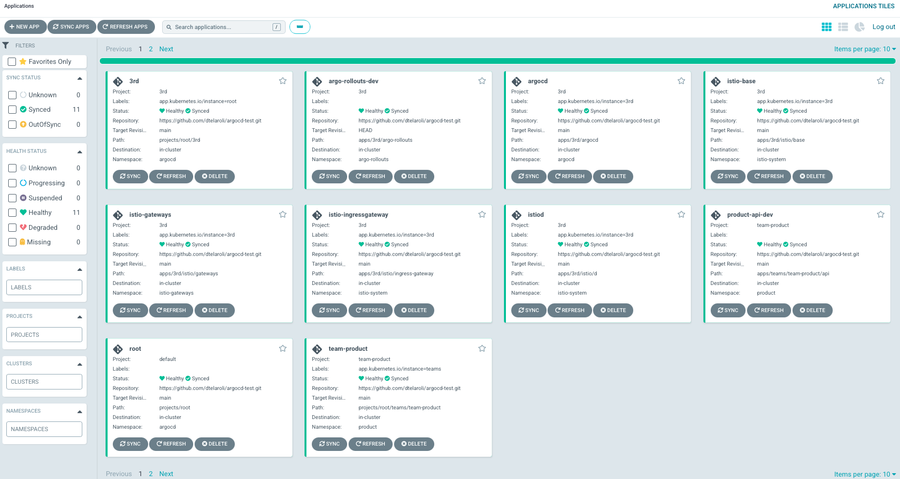
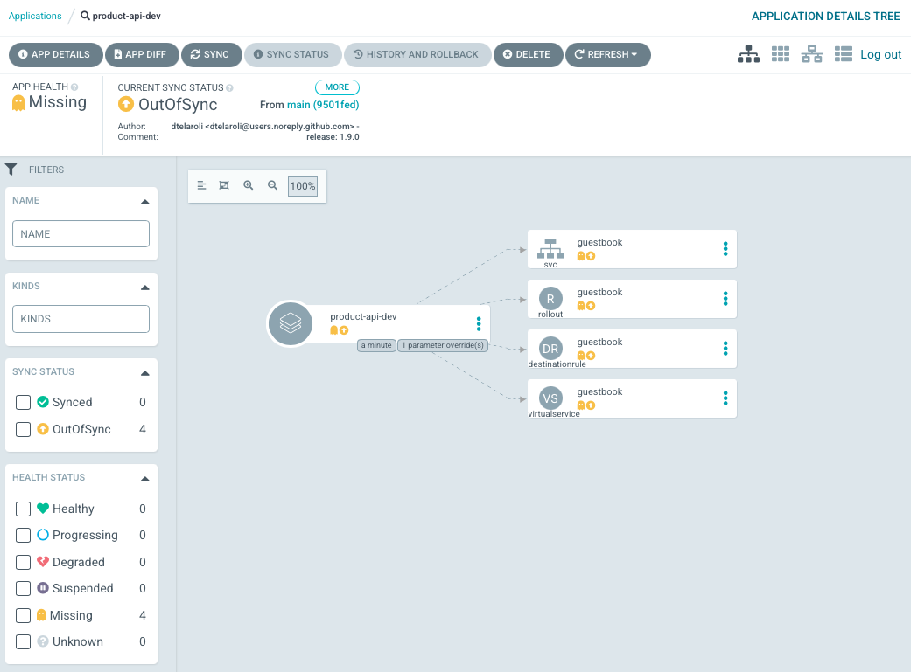
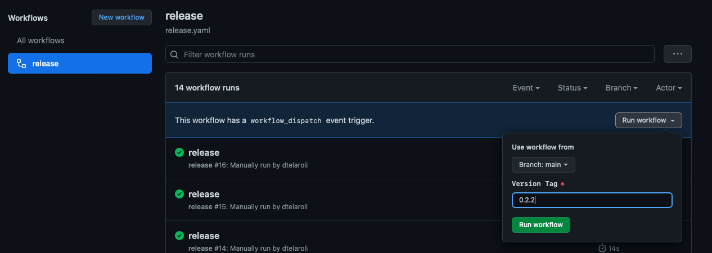
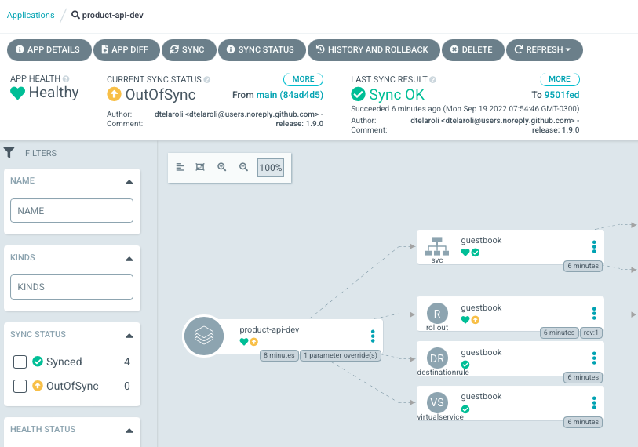
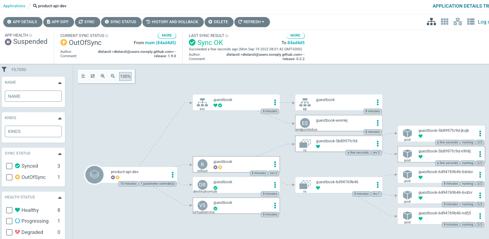
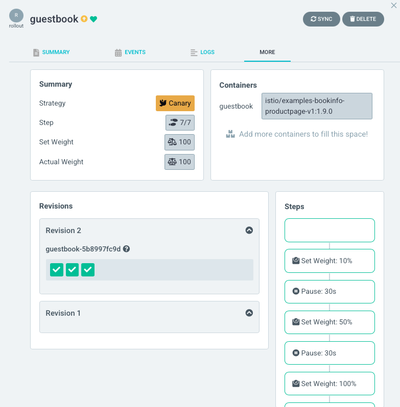

# argocd-test

Project to demonstrate GitOps with GithubActions and ArgoCD.


## Componentes

- [ArgoCD](https://argo-cd.readthedocs.io/en/stable/)
- [Argo Rollouts](https://argoproj.github.io/argo-rollouts/)
- [Istio](https://istio.io)
- [Github Actions](https://github.com/features/actions)

## Installation

First of all, we need install manually the ArgoCD in the cluster. It will be our manager to install any k8s components, such: Argo-Rollouts and Istio.

To install and configure the ArgoCD in the cluster, execute the command below:

```shell
make install
```

The script install the ArgoCD, configure the admin password and creates the root project, which is responsible to create the whole applications.

## GitOps

### ArgoCD password

The default password is stored in a configmap. Execute the command below to get the password:

```shell
make pass
```

The install script changes (or even try to change) the password to: `admin123`

### ArgoCD console

You can test the ArgoCD installation executing the port-forward and accessing it in the browser:

```shell
make forward
open https://localhost:8888
```

After the configuration of whole applications, the ArgoCD will be accessible by a new domain: `argocd.mydomain.com`. To it to be accessible in localhost, you must to add the host to the `/etc/hosts` file. Execute the command below:

```shell
make restart
sudo make hosts
open https://argocd.mydomain.com
```



All applications have autosync configured, except the product-api-dev, which should be synced manually. Open the application and click in sync->syncronize buttom (sometimes we need sync twice).



### Deploy

To deploy a new version of the app go to the [Github Actions](https://github.com/dtelaroli/argocd-test/actions/workflows/release.yaml) and build a new version choosing for one [application tag](https://hub.docker.com/r/istio/examples-bookinfo-productpage-v1/tags).

The action will update the version in the [values.yaml manifest](https://github.com/dtelaroli/argocd-test/blob/main/apps/teams/team-product/api/values.yaml) to the new version.



It will turns the ArgoCD app out-of-sync.



Syncing the application, it will starts a new ArgoRollout process, splitting the traffic between old and new replicasets until the end of the process.



We have an ArgoRollout extension witch allows to see the rollout steps, click over the rollout object to see the details in the more tab:



To access the application open the URL: https://guestbook.mydomain.com.

```shell
make open
```

## Tree

```shell
.
├── Makefile
├── README.md
├── apps
│   ├── 3rd
│   │   ├── argo-rollouts
│   │   │   └── kustomization.yaml
│   │   ├── argocd
│   │   │   ├── kustomization.yaml
│   │   │   ├── patches
│   │   │   │   ├── argocd-cm.yaml
│   │   │   │   ├── argocd-cmd-params-cm.yaml
│   │   │   │   └── argocd-rbac-cm.yaml
│   │   │   └── virtual-service.yaml
│   │   └── istio
│   │       ├── base
│   │       │   ├── Chart.yaml
│   │       │   └── requirements.yaml
│   │       ├── d
│   │       │   ├── Chart.yaml
│   │       │   └── requirements.yaml
│   │       ├── gateways
│   │       │   ├── argocd-secret.yaml
│   │       │   ├── gateway.yaml
│   │       │   ├── guestbook-secret.yaml
│   │       │   └── kustomization.yaml
│   │       └── ingress-gateway
│   │           ├── Chart.yaml
│   │           └── requirements.yaml
│   └── teams
│       └── team-product
│           └── api
│               ├── Chart.yaml
│               ├── requirements.yaml
│               └── values.yaml
├── charts
│   └── canary
│       ├── Chart.yaml
│       ├── README.md
│       ├── templates
│       │   ├── argo-rollout.yaml
│       │   ├── destination-rule.yaml
│       │   ├── service.yaml
│       │   └── virtual-service.yaml
│       ├── values-lint.yaml
│       ├── values.schema.json
│       └── values.yaml
├── environments
│   └── dev
│       └── config.yaml
├── projects
│   ├── argo-application.yaml
│   ├── kustomization.yaml
│   └── root
│       ├── 3rd
│       │   ├── argo-application.yaml
│       │   ├── argo-project.yaml
│       │   ├── argo-rollouts
│       │   │   ├── argo-applicationset.yaml
│       │   │   └── kustomization.yaml
│       │   ├── argocd
│       │   │   ├── argo-application.yaml
│       │   │   └── kustomization.yaml
│       │   ├── istio
│       │   │   ├── _requisites
│       │   │   │   ├── kustomization.yaml
│       │   │   │   ├── namespace-istio-gateways.yaml
│       │   │   │   └── namespace-istio-system.yaml
│       │   │   ├── base
│       │   │   │   ├── argo-application.yaml
│       │   │   │   └── kustomization.yaml
│       │   │   ├── d
│       │   │   │   ├── argo-application.yaml
│       │   │   │   └── kustomization.yaml
│       │   │   ├── gateways
│       │   │   │   ├── argo-application.yaml
│       │   │   │   └── kustomization.yaml
│       │   │   ├── ingress-gateway
│       │   │   │   ├── argo-application.yaml
│       │   │   │   └── kustomization.yaml
│       │   │   └── kustomization.yaml
│       │   └── kustomization.yaml
│       ├── kustomization.yaml
│       └── teams
│           ├── argo-application.yaml
│           ├── argo-project.yaml
│           ├── kustomization.yaml
│           └── team-product
│               ├── _requisites
│               │   ├── kustomization.yaml
│               │   └── namespace.yaml
│               ├── api
│               │   ├── argo-applicationset.yaml
│               │   └── kustomization.yaml
│               ├── argo-application.yaml
│               ├── argo-project.yaml
│               └── kustomization.yaml
└── scripts
    └── update_pass.sh
```

### Disclaimer

It's a best practice don't use the application manifests in the same repository witch the ArgoCD application is managed, so the folder `apps/teams/team-product/api` should be in other repo. The best place to put the api manifests is in the its self repository. Here it's in the same repository for tests purpose.
